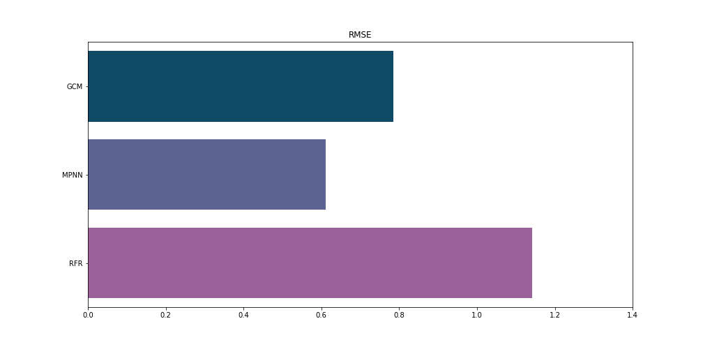

# Molecule solubility
We tried to predict water solubility of molecules based on molecular structure. Graph models used are from machine learning library [deepchem](https://github.com/deepchem/deepchem). We compared:
- Graph Convolutional Model
- Message Passing Neural Network
- Random Forest Regressor.

## Results
Dataset was split into training (80%) and testing (20%) set. Results were measured on testing set. Best performance was achieved by graph models especially MPNN.
| Model | RMSE  |  MAE  |  R2   |
|:-----:|:-----:|:-----:|:-----:|
|  GCM  | 0.784 | 0.625 | 0.868 |
| MPNN  | 0.610 | 0.479 | 0.920 |
|  RFR  | 1.142 | 0.872 | 0.701 |

